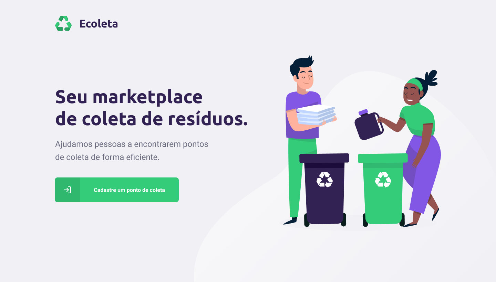
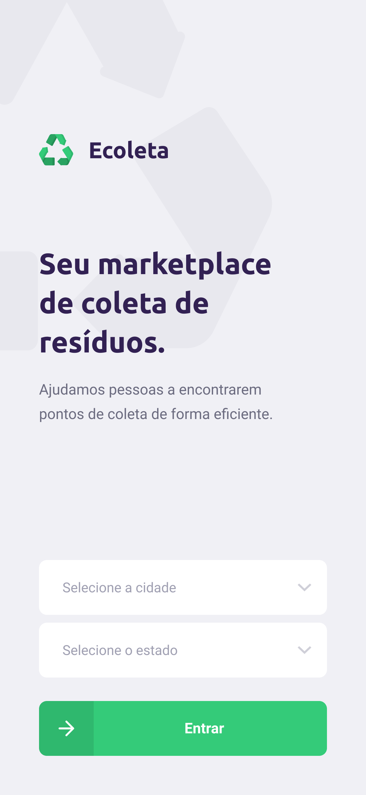
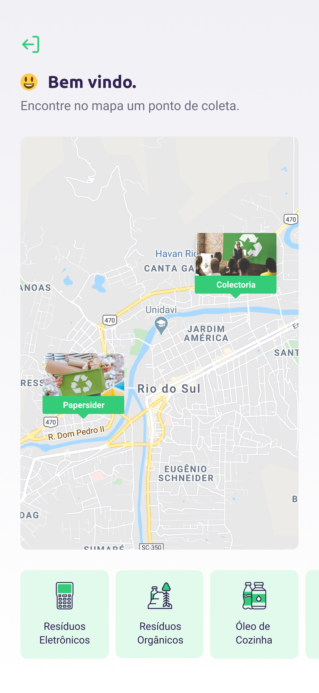

<h1 align="center">
    
    <br>Next Level Week #01<br/>
    NodeJS | ReactJS | React Native
</h1>

<p align="center">
  
  
   
  <br/>
</p>
<p align="center">
  <a href="#bookmark-sobre">Sobre</a>&nbsp;&nbsp;&nbsp;|&nbsp;&nbsp;&nbsp;
  <a href="#rocket-tecnologias">Tecnologias</a>&nbsp;&nbsp;&nbsp;|&nbsp;&nbsp;&nbsp;
  <a href="#boom-como-executar">Como Executar</a>&nbsp;&nbsp;&nbsp;|&nbsp;&nbsp;&nbsp;
  <a href="#memo-licença">Licença</a>
</p>

## 

<p>
  

 
<p>

## :bookmark: Sobre

**Ecoleta** tem como finalidade estabelecer uma conexão entre empresas e/ou entidades que coletam resíduos (orgânicos e inorgânicos) às pessoas e/ou entidades que necessitam constantemente descartar esses resíduos. Solucionando um grande problema recorrente que é o descarte inadequado do lixo, facilitando o processo de recliclagem e reutilização.

Essa aplicação foi realizada durante a Next **Level Week #01**, projeto da [Rocketseat](https://rocketseat.com.br/).

## :rocket: Tecnologias

- [Typescript](https://www.typescriptlang.org/)
- [Node.js](https://nodejs.org/en/)
- [ReactJS](https://reactjs.org/)
- [React Native](http://facebook.github.io/react-native/)
- [Expo](https://expo.io/)

## :boom: Como Executar

- ### **Pré-requisitos**

  - É **necessário** possuir o **[Node.js](https://nodejs.org/en/)** instalado no computador
  - É **necessário** possuir o **[Git](https://git-scm.com/)** instalado e configurado no computador
  - Também, é **preciso** ter um gerenciador de pacotes seja o **[NPM](https://www.npmjs.com/)** ou **[Yarn](https://yarnpkg.com/)**.
  - Por fim, é **essencial** ter o **[Expo](https://expo.io/)** instalado de forma global na máquina

1. Faça um clone do repositório:

```sh
  // HTTPS
  $ git clone https://github.com/joaom00/Ecoleta.git

  // SSH
  $ git clone git@github.com:joaom00/Ecoleta.git
```

2. Executando a Aplicação:

```sh
  # API
  $ cd server

  # Instalando as dependências do projeto.
  $ yarn # ou npm install

  # Configurando o banco de dados e criando as tabelas.
  $ yarn knex:migrate # ou npm run knex:migrate

  # Inicie a API
  $ yarn start # ou npm start

  ---------------------------------------

  # Aplicação web
  $ cd web

  # Instalando as dependências do projeto.
  $ yarn # ou npm install

  # Inicie a aplicação web
  $ yarn start # ou npm start

  ---------------------------------------

  # Aplicação mobile
  $ cd mobile

  # Instalando as dependências do projeto.
  $ yarn # ou npm install

  # Inicie a aplicação mobile
  $ yarn start # ou npm start
```

## :memo: Licença

Esse projeto está sob a licença MIT. Veja o arquivo [LICENSE](LICENSE.md) para mais detalhes.

---

<sup>Projeto desenvolvido com a tutoria de [Diego Fernandes](https://github.com/diego3g), da [Rocketseat](rocketseat.com.br).</sup>
